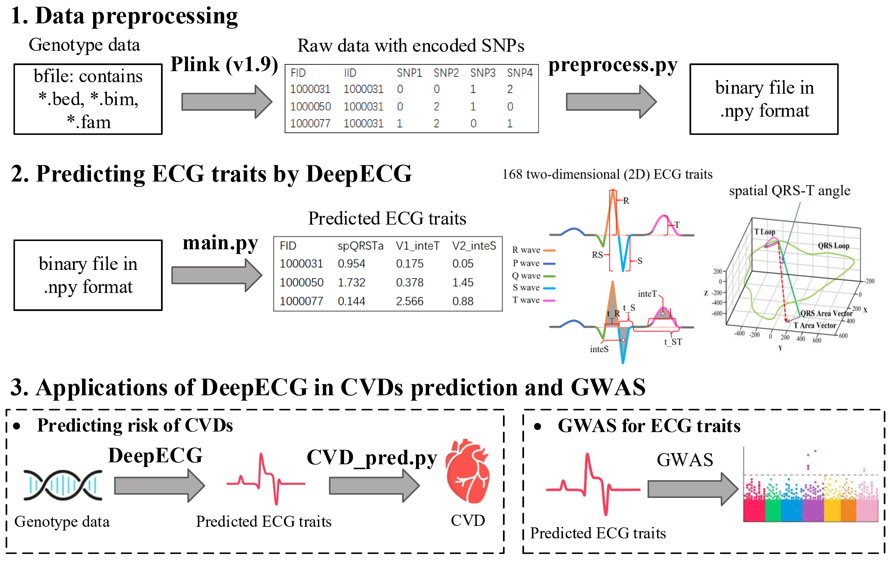
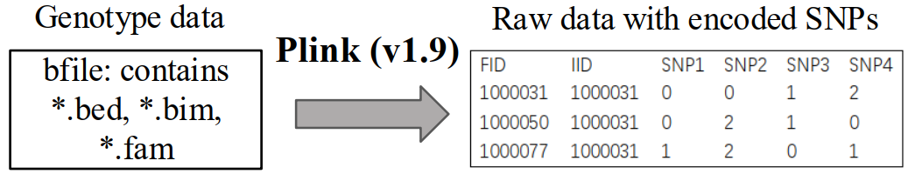
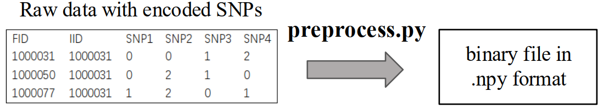
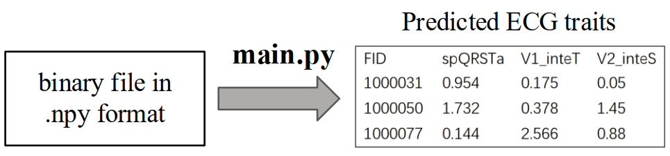
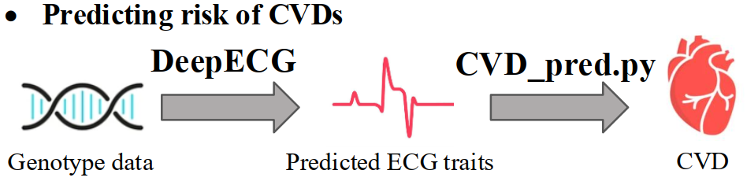
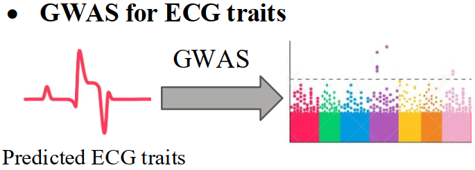

# DeepECG: Empowering genome-wide association study by imputing electrocardiograms from genotype in UK-biobank 
DeepECG is a densely connected network for ECG traits prediction using genotype data. The predicted ECG traits by DeepECG can be used to predict cardiovascular diseases (CVDs) risk and perform GWAS.

## Installation

To reproduce **DeepECG**, we suggest first create a conda environment by:

~~~shell
conda create -n DeepECG python=3.8
conda activate DeepECG
~~~

and then run the following code to install the required package:

~~~shell
pip install -r requirements.txt
~~~
### Requirements
- `pytorch(1.8.1)`
- `torchvision(0.9.1)`
- `matplotlib(3.3.4)`
- `pandas(1.1.5)`
- `tqdm(4.62.3)`
- `numpy(1.19.2)`
- `scikit-learn(1.0.2)`
- `scipy(1.6.2)`

PLINK (v1.90) can be downloaded from  https://www.cog-genomics.org/plink/ .

## 1. Data preprocessing


### 1.1 Extracting SNPs from bfile and encoding SNP as (0/1/2)



PLINK (v1.90) is used to extract specific SNPs required for running DeepECG from the genotype data in bfile format. These SNPs are encoded as sample-major additive **(0/1/2)**. Here,“0” refers to homozygous for the reference allele, “1” refers to heterozygous for the alternative allele, and “2” refers to the homozygous for the alternative allele. The results will be saved in "rawdata_path". The code is:

```
cd DeepECG
plink --bfile mydata \ # input data (plink bfile)
	  --extract ./data/SNP_list/SNP_path \ #input data (SNPs used for ECG prediction)
	  --export A \
	  --out ./data/npy_data/rawdata_path #output
```
By running the above code, the output file will be stored in one specific path:
- `./data/npy_data/rawdata_path`: storing the specific SNPs encoded as 0/1/2

An example raw data can be downloaded from “./data/Example_spQRSTa.raw”

### 1.2 Convert raw data into binary file in .npy format



The genotype data pre-processed by PLINK will be converted into an array, a binary file in “.npy” format by  numpy(1.19.2). The code is:

```
python ./preprocess.py --rawdata ./data/npy_data/rawdata_path \ #input data (geneotype raw data)
	      --geno_out ./data/npy_data/npy_path \ #output (genotype data in .npy format)
              --FID_out ./data/npy_data/FID_path #output (sample ID)
```
By running the above command, two files will be generated under specific path: 
- `./data/npy_data/npy_path`: a binary file storing the genotype data in .npy format
- `./data/npy_data/FID_path`: a table file storing the sample ID

## 2. Predicting ECG traits by DeepECG



The processed genotype data are used as input of DeepECG. DeepECG will output a table (column name: FID, predicted_trait) in .csv format. The first column of output file is the sample ID, the second column is predicted value (ranging from -1, 1) of ECG trait. The code is:

```
python main.py  --ECG_trait feature \ # indicated ECG trait for prediction
                --geno_path  ./data/npy_data/npy_path \ # input genotype data
                --FID_path  ./data/npy_dataFID_path \ # input sample ID
                --out ./data/predicted_ECG_traits/feature.csv  # output ECG trait
```
Running the above command will generate one output file in the output path:
- `./data/predicted_ECG_traits/feature.csv`: a table file storing the predicted ECG trait.

The "ECG_trait" is the name of the ECG trait (For example, spQRSTa, III_S) required input of "main.py". The name of the ECG trait can be found from ".data/ECG_traits_list.txt". 

## 3. Applications of DeepECG in CVDs prediction and GWAS

### 3.1 Use ECG traits to predict cardiovascular disease



The output file of “main.py” is input into "cvd_pred.py" to predict the risk of CVDs by running the code:
```
python CVD_predict.py  --CVD_name CVD \ # the name of cardiovascular disease for prediction
                --ECG_trait_path  ./data/predicted_ECG_traits/feature.csv \ # input ECG traits
                --out ./data/CVD_risk.csv  # output (predicted CVD risk)
```
Running the above command will generate one output file in the output path:
- `./data/predicted_ECG_traits/feature.csv`: a table storing the predicted CVD risk. The first column is the sample ID, and the second column is the predicted risk of the disease.

The code "cvd_pred.py" is developed for predicting nine types of diseases including essential hypertension (EH), angina pectoris (AP), myocardial infarction (MI), ischaemic heart disease (IHD), Atrial fibrillation (AF), Aortic aneurysm (AA), Cardiomyopathy (CM), Coronary atherosclerosis (CA), and all-cause Heart Failure (HF).
The "CVD_name" is required input into "cvd_pred.py", which is the short name of disease.


### 3.2 Use ECG traits to perform GWAS analysis



When DeepECG has been used in a large population for predicting ECG traits from genotype, the predicted ECG traits is able to be used for GWAS to identify novel SNP assocations. The code of BOLT-LMM (v2.3.5) for GWAS is availabe at  https://alkesgroup.broadinstitute.org/BOLT-LMM/BOLT-LMM_manual.html, and BOLT-LMM can be run by the code:

```
./BOLT-LMM_v2.3.5/bolt --bfile=$file_bfile \ # input genotype data
--LDscoresFile=$file_ld \ # input SNP LD data
--lmm \
--phenoFile=$file_pheno \ # input ECG trait data
--phenoCol=$trait \ # input ECG trait
--modelSnps=$file_modsnp \ # input SNP list
--numThreads=$nthread \
--statsFile=$file_out # output GWAS
```

## Citation

If you find our codes useful, please consider citing our work:

~~~bibtex


@article{
  title={Empowering genome-wide association study by imputing electrocardiograms from genotype in UK-biobank},
  author={Siying Lin, Mengling Qi, Yuedong Yang, Huiying Zhao*},
  journal={},
  year={2024},
}
~~~
