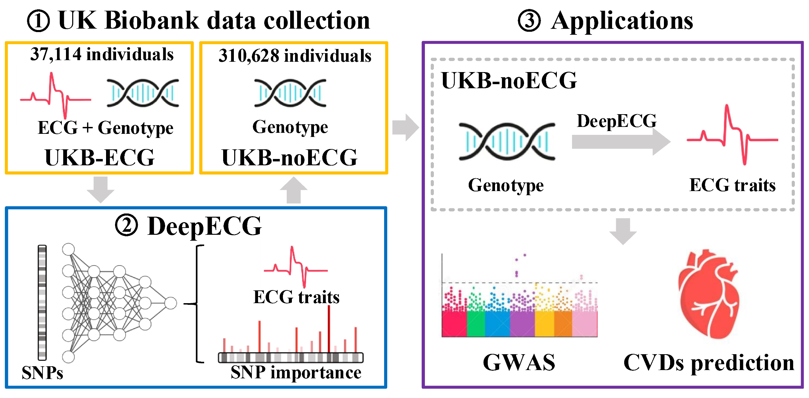

# DeepECG: Empowering genome-wide association study by imputing electrocardiograms from genotype in UK-biobank 
DeepECG is a densely connected network that can be used to predicted ECG traits from genotype.

**Table of Contents**

* [Installation](#Installation)
* [Usage](#Usage)
* [Citation](#Citation)

## Installation

To reproduce **DeepECG**, we suggest first create a conda environment by:

~~~shell
conda create -n DeepECG python=3.8
conda activate DeepECG
~~~

and then run the following code to install the required package:

~~~shell
pip install -r requirements.txt
~~~
### Requirements
- `pytorch(1.8.1)`
- `torchvision(0.9.1)`
- `matplotlib(3.3.4)`
- `pandas(1.1.5)`
- `tqdm(4.62.3)`
- `numpy(1.19.2)`
- `scikit-learn(1.0.2)`
- `scipy(1.6.2)`

## Usage 
### 1. Data preprocessing

In order to run **DeepECG** , we need to first create genotype data as a binary file from bfile data.

**1.1 Extract SNPs from bfile and encode SNP as (0/1/2)**

Use PLINK (v1.90) to extract specific SNPs from the genotype data stored in the "mydata" files and encode the SNPs as sample-major additive (0/1/2). “0” refers to homozygous for the reference allele, “1” refers to heterozygous for the alternative allele, and “2” refers to the homozygous for the alternative allele. The results will be saved in "rawdata_path".

```
cd DeepECG
plink --bfile mydata \ # input data (plink bfile)
	  --extract ./data/SNP_list/SNP_path \ #input data (SNPs used for ECG prediction)
	  --export A \
	  --out ./data/npy_data/rawdata_path #output
```
Running the above command will generate one output file in the output path:
- `./data/npy_data/rawdata_path`: specific SNPs encoded as 0/1/2

The raw data of UKB-noECG dataset can be downloaded from https://zenodo.org/uploads/10935155

**1.2 Convert rawdata into array**

Use numpy(1.19.2) to covert the raw data into array as a binary file in .npy format

```
python ./preprocess.py --rawdata ./data/npy_data/rawdata_path \ #input data (geneotype raw data)
	      --geno_out ./data/npy_data/npy_path \ #output (genotype data in .npy format)
              --FID_out ./data/npy_data/FID_path #output (human id)
```
Running the above command will generate two output files in the output path:
- `./data/npy_data/npy_path`: genotype data in .npy format
- `./data/npy_data/FID_path`: human id

### 2. Use DeepECG to predict ECG traits from genotype data

The processed genotype data are used as input to DeepECG and output a table (column name: FID, predicted_trait) in .csv format

```
python main.py  --ECG_trait feature \ # indicated ECG trait for prediction
                --geno_path  ./data/npy_data/npy_path \ # input genotype data
                --FID_path  ./data/npy_dataFID_path \ # input human ID
                --out ./data/predicted_ECG_traits/feature.csv  # output ECG trait
```


## Citation

If you find our codes useful, please consider citing our work:

~~~bibtex


@article{
  title={Empowering genome-wide association study by imputing electrocardiograms from genotype in UK-biobank},
  author={Siying Lin, Mengling Qi, Yihan Chen, Yuedong Yang, Huiying Zhao*},
  journal={},
  year={2024},
}
~~~
